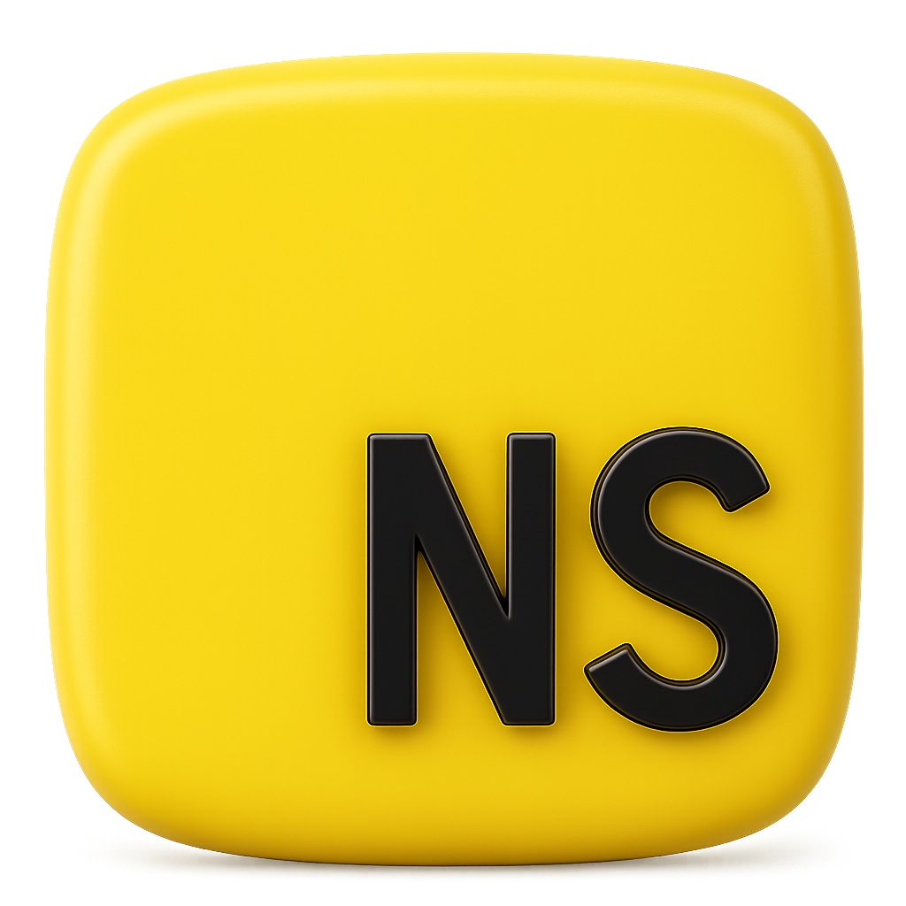

<div align="center">
  
  <h1 align="center">
    <a href="https://github.com/nullscript-lang/nullscript">NullScript</a>
  </h1>

  <p align="center">
    <strong>JavaScript with Attitude</strong> - A fun parody programming language that transpiles to clean JavaScript
  </p>

  <p align="center">
    <a href="https://github.com/nullscript-lang/nullscript/releases">
      
    </a>
    <a href="https://github.com/nullscript-lang/nullscript/blob/main/LICENSE">
      
    </a>
    <a href="https://npmjs.com/package/nullscript">
      
    </a>
  </p>

  <p align="center">
    <a href="https://nullscript.js.org">📚 Documentation</a>
    ·
    <a href="https://nullscript.js.org/examples/basic.html">💡 Examples</a>
    ·
    <a href="https://nullscript.js.org/reference/keywords.html">🔤 Keywords</a>
    ·
    <a href="https://github.com/nullscript-lang/nullscript/issues">🐛 Report Bug</a>
    ·
    <a href="https://github.com/nullscript-lang/nullscript/discussions">💬 Discuss</a>
  </p>
</div>

## ✨ Features

- 🎪 **Fun keyword aliases** (`speak` instead of `console`, `run` instead of `function`, etc.)
- 🔧 **Pure JavaScript output** - no type annotations, just clean JS
- 📁 **`.ns` file extension** for that special feeling
- ⚡ **Zero runtime overhead** - compiles directly to JavaScript
- 🛠️ **CLI tooling** with build and run commands

## 🚀 Quick Start

### Installation

```bash
npm install -g nullscript
```

### Your First NullScript Program

Create `hello.ns`:

```javascript
run greet(name) {
  return `Hello, ${name}! Welcome to NullScript! 🎭`;
}

fixed message = greet("Developer");
speak.say(message);
```

### Run it!

```bash
nsc run hello.ns
```

## 📚 Documentation

**📖 [Full Documentation Available Here](https://nullscript.js.org)**

The documentation site includes:
- Complete language reference
- All keyword aliases and their JavaScript equivalents
- Advanced examples and tutorials
- CLI usage guide
- Best practices and tips

## 🛠️ Basic CLI Usage

```bash
# Transpile to JavaScript
nsc build src/ --outDir dist

# Run NullScript directly
nsc run hello.ns

# Show all keywords
nsc keywords
```

## 💻 Quick Example

```javascript
use { readFileSync } from 'fs';

model Greeter {
  run greet(person) {
    whatever (person.age moreeq 18) {
      return `Hello, ${person.name}! You're an adult.`;
    } otherwise {
      return `Hello, ${person.name}! You're young.`;
    }
  }
}

fixed greeter = fresh Greeter();
let person = { name: "Alice", age: 25 };
speak.say(greeter.greet(person));
```

---

**📖 [Visit the full documentation](https://nullscript.js.org) for complete language reference, examples, and tutorials.**

*"NullScript: Because programming should be fun, even when it's serious."*
